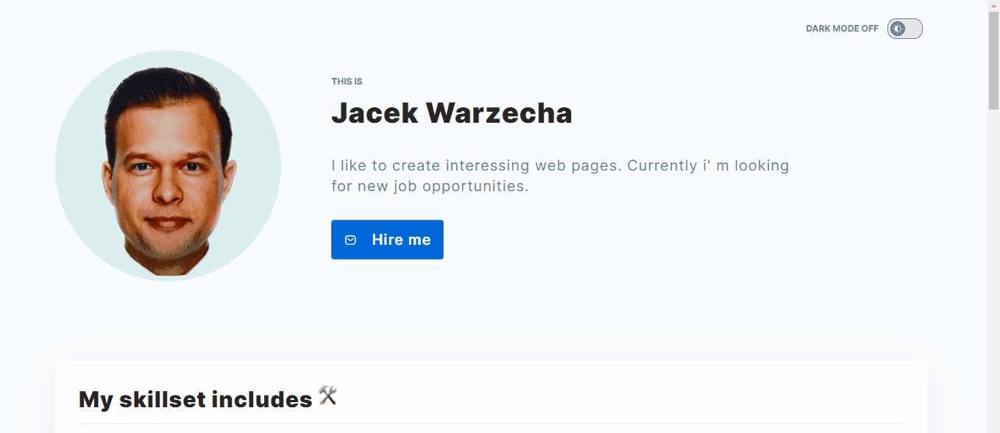

### Welcome :)

 

#### That's my visiting card, where You can find:

- contact to me
- written projects

 

##### Here You can see this webside:

 

#### Connect with my personal-homepage: [CLICK](https://jacekwarzecha.github.io/personal-homepage/)

 

### Some my skills:

 

### Github Stats

 

 

